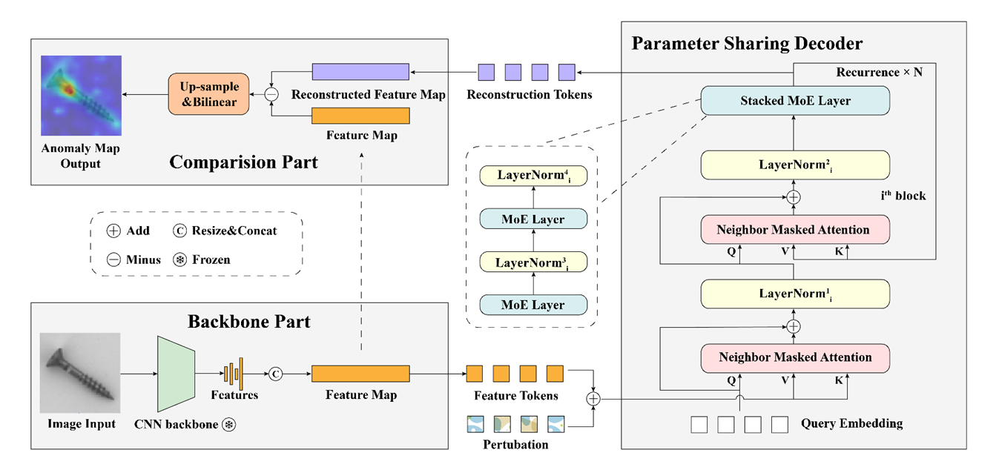

# [MoEAD](https://www.ecva.net/papers/eccv_2024/papers_ECCV/papers/11465.pdf)

Code of MoEAD: A Parameter-efficient Model for Multi-class Anomaly Detection, accepted by ECCV 2024.
article:https://www.ecva.net/papers/eccv_2024/papers_ECCV/html/11465_ECCV_2024_paper.php

## Updates
- 26.09.2024: Code has been released.
- 20.11.2024: Some code mistakes have been corrected.


## Abstract

Utilizing a unified model to detect multi-class anomalies is a promising solution to real-world anomaly detection. Despite their appeal, such models typically suffer from large model parameters and thus pose a challenge to their deployment on memory-constrained embedding devices. To address this challenge, this paper proposes a novel ViT-style multi-class detection approach named MoEAD, which can reduce the model size while simultaneously maintaining its detection performance. Our key insight is that the FFN layers within each stacked block (i.e., transformer blocks in ViT) mainly characterize the unique representations in these blocks, while the remaining components exhibit similar behaviors across different blocks. The finding motivates us to squeeze traditional stacked transformed blocks from N to a single block, and then incorporate Mixture of Experts (MoE) technology to adaptively select the FFN layer from an expert pool in every recursive round. This allows MoEAD to capture anomaly semantics step-by-step like ViT and choose the optimal representations for distinct class anomaly semantics, even though it shares parameters in all blocks with only one. Experiments show that, compared to the state-of-the-art (SOTA) anomaly detection methods, MoEAD achieves a desirable trade-off between performance and memory consumption. It not only employs the smallest model parameters, has the fastest inference speed, but also
obtains competitive detection performance.


## Overview of MoEAD




## How to run

### 1. Installation

python version=3.8

```
pip3 install -r requirements.txt
```

Then we need to install [fastmoe](https://github.com/laekov/fastmoe), a step-by-step tutorial for the installation procedure can be found [here](https://github.com/laekov/fastmoe/blob/master/doc/installation-guide.md).

```
git clone https://github.com/laekov/fastmoe.git
cd fastmoe
python setup.py install
```


### 2. Dataset

- MVTec-AD

Download the MVTec-AD dataset from [here](https://www.mvtec.com/company/research/datasets/mvtec-ad). Unzip the file and move them to `./data/MVTec-AD`. The MVTec-AD dataset directory should be as follows.

```
|-- data
  |-- MVTec-AD
​    |-- mvtec_anomaly_detection
​    |-- json_vis_decoder
​    |-- train.json
​    |-- test.json
```

- VisA

Download the VisA dataset from [here](https://github.com/amazon-science/spot-diff). Follow the instruction in the link. After the part of data preparation in the instruction, move them to `./data/VisA_pytorch`. The VisA dataset directory should be as follows.

```
|-- data
  |-- VisA_pytorch
​    |-- 1cls
​    |-- train.json
​    |-- test.json
```


### 3. Train

```
cd ./experiments/MVTec-AD/
sh train_torch.sh #NUM_GPUS #GPU_IDS
```


### 4. Test

```
cd ./experiments/MVTec-AD/
sh eval_torch.sh #NUM_GPUS #GPU_IDS
```

The evaluation results are shown the same as [UniAD](https://github.com/zhiyuanyou/UniAD). In our paper, we use *max* for MVTec-AD and VisA.

Results and Checkpoints:

| Model | Datasets | Detection AUROC | Localization AUROC |                         Checkpoints                          |
| :---: | :------: | :-------------: | :----------------: | :----------------------------------------------------------: |
| MoEAD | MVTec-AD |      97.7       |        97.0        | [link](https://drive.google.com/drive/folders/15KwqzbHqUQr4EbP2Fqsq3F17OmSrX2zE?usp=drive_link) |


## Acknowledgement

We thank for these great repositories including [UniAD](https://github.com/zhiyuanyou/UniAD) and [fastmoe](https://github.com/laekov/fastmoe) for assistance in our work.


## Citation

If you find this paper and repository useful, please cite our paper.
